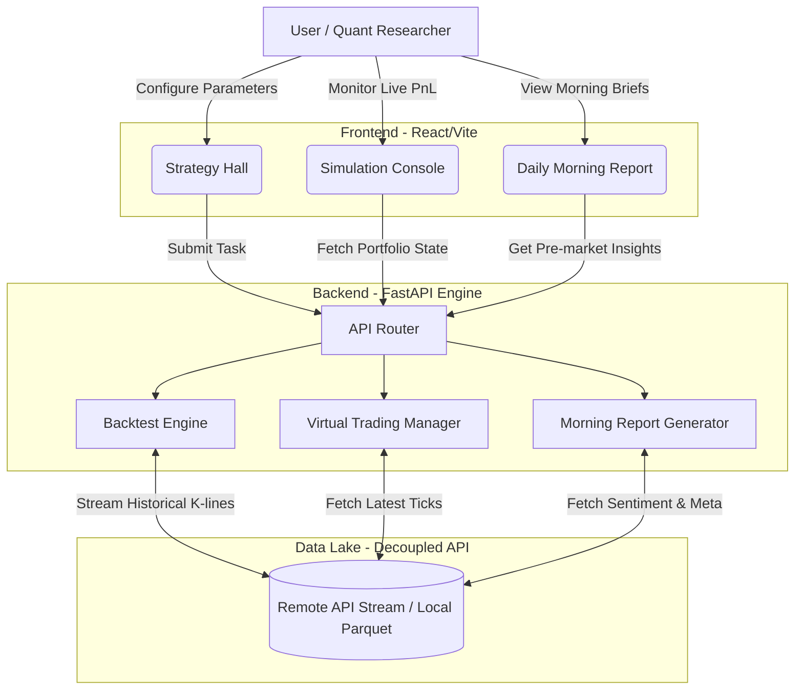

# Quant-Viz-Backtest (momo quant pro)


A high-performance, cloud-native quantitative trading backtest engine and visualization console. 

**Quant-Viz-Backtest** is designed to provide institutional-grade backtesting capabilities while maintaining extreme lightweight deployability. It completely decouples the heavy market data lake from the core engine, allowing researchers to run massive strategy backtests purely via API streams or local Parquet caches.

---

## 🌟 Core Features (核心特性)

### 1. ☁️ Serverless-Ready Data Lake (云原生数据湖解耦)
No need to bundle 50GB+ of data with your code. By simply injecting the `DATA_LAKE_API_URL` environment variable, the engine bypasses local storage and streams real-time / historical data directly via high-speed **Apache Arrow / Parquet** binary streams.
*(Local cache fallback remains 100% supported for offline research).*

### 2. 🧠 Strategy Matrix (11套核心策略矩阵)
The engine comes pre-loaded with a diverse arsenal of quantitative strategies:
- **AI Models**: ETF Bottom Picker (Aggressive & Stable), Machine Learning Synthesizer.
- **Signal Factory**: Overnight Hold (一夜持股), Weak-to-Strong Reversal (弱转强), Limit-up Doji (涨停十字星).
- **Classic Quant**: Industry Selection, High-Frequency Turtle Trading, HFMR, Oversold Reversal, ATM Trend Enhancement.

### 3. 📈 Comprehensive Data Coverage (全维度数据覆盖)
Supports the full A-share market and major ETFs (2022 to Present), deeply integrated with 11+ core factors including PE, PB, Turnover Rate, PS, PCF, and ST status.

---

## 🖥️ Frontend Modules & Workflow (前端功能与工作流)

The React/Vite-powered frontend is built around a dual-layer architecture, delivering blazing-fast charting and seamless interaction.

### 1. Strategy Hall (策略大厅)
- **Features**: An intuitive dashboard to select strategies, adjust hyper-parameters (e.g., stop-loss, take-profit, holding limits), and trigger multi-year backtests.
- **Visualization**: Renders comprehensive equity curves, max drawdown charts, win-rate radar charts, and PnL heatmaps. 
- **Interactions**: Supports deep-dive analysis through interactive tooltips (hovering over any trade node reveals exact entry/exit reasons) and keyboard shortcuts.

### 2. Simulation Console (仿真控制台)
- **Features**: A real-time virtual trading execution environment. It synchronizes with the data engine to simulate live trading environments based on the latest market ticks.
- **Operations**: Manages active portfolios, calculates dynamic PnL, tracks overnight holdings, and automatically liquidates positions that hit risk thresholds.

### 3. Daily Morning Report (早盘看板)
- **Features**: Aggregates pre-market technical trends, ETF momentum shifts, and overnight news sentiment, generating actionable daily briefings before the market opens.

### 🔄 System Workflow Diagram (各板块工作流程)



---

## 🚀 Quick Start (快速启动)

### 1. Start the Backend API (启动后端)
If you are deploying in a cloud environment, you can point the engine to your remote data API gateway:
```bash
cd backend
export DATA_LAKE_API_URL="http://your-data-lake-gateway.com" # Optional for cloud mode
pip install -r requirements.txt
python main.py
```
*(If `DATA_LAKE_API_URL` is omitted, the engine will safely read from the local `/Users/gdxj/quant_data_lake` directory).*

### 2. Start the Frontend (启动前端)
```bash
cd frontend
npm install
npm run dev
```

---

## ⚙️ Architecture Highlights

- **FastAPI Backend**: Port 8080. Handles strategy pipelines, multi-threading data loading, and risk management.
- **React/Vite Frontend**: Port 5173. Provides lightning-fast charts, keyboard shortcuts, and hover-to-view trade details.
- **Multi-level Caching**: Memory LRU cache + Disk Parquet + API streaming ensures backtests run in milliseconds without redundant network requests.

---
*Generated by K秘 for Mr. Xiao.*
