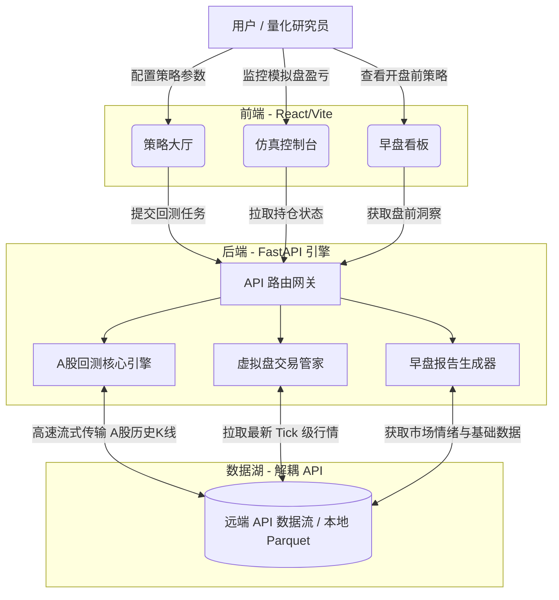

# Quant-Viz-Backtest (momo quant pro)


一个高性能、云原生的量化交易回测引擎与可视化控制台，专为 **A股及国内公募ETF** 市场打造。

**momo quant pro** 旨在提供机构级别的回测能力，同时保持极其轻量的部署体验。系统将沉重的市场数据湖与核心引擎完全解耦，使研究人员能够纯粹通过 API 数据流或本地 Parquet 缓存，极速运行海量策略回测。

---

## 🌟 核心特性 (Core Features)

### 1. ☁️ 云原生数据湖解耦 (Serverless-Ready)
无需将几十GB的 A股与ETF 历史数据随代码绑定。只需注入 `DATA_LAKE_API_URL` 环境变量，引擎即可绕过本地存储，直接通过高速的 **Apache Arrow / Parquet** 二进制流拉取实时和历史行情。
*(断网或本地研究时，系统仍 100% 支持本地缓存回退)。*

### 2. 🧠 A股实战策略矩阵 (Strategy Matrix)
引擎内置了专为 A股与ETF 市场调优的 11 套量化策略库：
- **AI 模型类**：ETF 抄底王（进攻型/稳健型）、机器学习因子合成引擎。
- **信号工厂类**：一夜持股策略、弱转强打板、涨停十字星捕捉。
- **经典量化类**：行业动量优选、高频海龟交易、HFMR、超跌反转、ATM 趋势增强。

### 3. 📈 全维度 A股/ETF 数据覆盖
完美支持 A股全市场（主板/创业板/科创板/北交所）及各大主流 ETF（涵盖境内外的跨境ETF），深度集成了 11+ 项核心因子（包括 PE、PB、换手率、PS、PCF 以及 ST 状态识别）。

---

## 🖥️ 前端功能与工作流 (Frontend Modules)

基于 React/Vite 构建的前端采用了“策略大厅 + 仿真控制台”的双层架构，带来丝滑的图表渲染与交互体验。

### 1. 策略大厅 (Strategy Hall)
- **核心功能**：直观的控制台，用于选择策略、调整超参数（止盈止损、持仓周期等），并一键触发多年跨度的历史回测。
- **可视化分析**：渲染资金曲线、最大回撤图、胜率雷达图和盈亏热力图。
- **深度交互**：支持快捷键操作与交互式悬浮提示（鼠标悬停于任何交易节点，即可查看精准的买卖点和信号触发原因）。

### 2. 仿真控制台 (Simulation Console)
- **核心功能**：实时的虚拟交易执行环境。它与后端数据引擎实时同步，根据最新的市场切片计算模拟盘盈亏。
- **资产管家**：管理持仓组合，计算动态 PnL，跟踪隔夜持股，并在触及风控阈值时自动平仓。

### 3. 早盘看板 (Daily Morning Report)
- **核心功能**：在 A股开盘前，聚合隔夜技术面趋势、ETF 动量异动以及市场情绪，为您生成极具实操价值的早报参考。

### 🔄 各板块工作流程图 (Workflow Diagram)



---

## 🚀 快速启动 (Quick Start)

### 1. 启动后端 API
如果您在云端部署，只需将引擎指向您的远端数据 API 网关即可实现无数据包启动：
```bash
cd backend
export DATA_LAKE_API_URL="http://您的数据网关地址" # 云端模式可选
pip install -r requirements.txt
python main.py
```
*(如果未配置 `DATA_LAKE_API_URL`，引擎会安全地读取本地 `/Users/gdxj/quant_data_lake` 目录)。*

### 2. 启动前端
```bash
cd frontend
npm install
npm run dev
```

---

## ⚙️ 架构亮点 (Architecture Highlights)

- **FastAPI 后端**: 运行于 8080 端口。全面接管策略管线、多线程数据拉取以及风控管理。
- **React/Vite 前端**: 运行于 5173 端口。提供极速图表渲染、键盘快捷键以及悬浮交易详情。
- **多级缓存架构**: 内存 LRU 缓存 + 磁盘 Parquet + API 数据流，确保回测在毫秒级完成，杜绝冗余的网络请求风暴。

---
*由 K秘 为肖君先生量身定制生成。*
